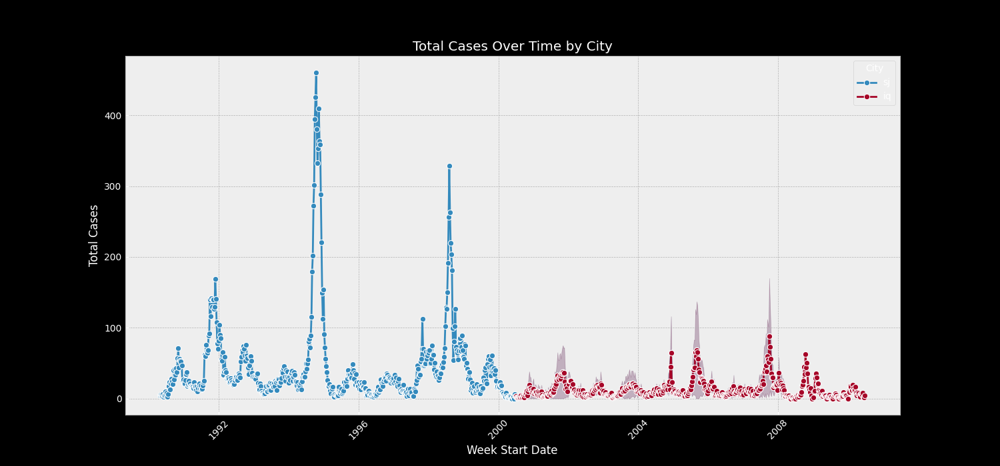

# DengAI: Predicting Disease Spread

## Overview

This project predicts local epidemics of dengue fever to help fight life-threatening pandemics. This project was created for entry to the [DengAI: Predicting Disease Spread](https://www.drivendata.org/competitions/44/dengai-predicting-disease-spread/page/80/) competition hosted by [Driven Data](https://www.drivendata.org/). 

The project predicts the number of Dengue Fever cases reported each week in the following locations:

- San Juan (Puerto Rico)
- Iquitos (Peru)

## Data

The predictor variables include environmental variables describing changes in temperature, precipitation, vegitation, and more.

## Usage

To allow interactive visualisation of the total cases over time by city, we built a simple Streamlit app. Click [here](https://dengai.streamlit.app/) to discover patterns in the data!

## Predictive Models

This is a time series project using [Random Forest](https://en.wikipedia.org/wiki/Random_forest) and [Negative Binomial](https://en.wikipedia.org/wiki/Negative_binomial_distribution) regression models to predict the total cases of Dengue fever over time in the different cities.

We used the [Mean Squared Error (MSE)](https://en.wikipedia.org/wiki/Mean_squared_error) metric for evaluating the model.

## Repository Structure
- `data/` - Contains the training and test datasets.
- `notebooks/` - Jupyter notebooks with exploratory data analysis and model development.
- `submissions/` - Prediction files ready for submission to the competition.
- `images/` - Visualizations generated during analysis, including the Scatterplot of total cases by city.

## Development
Clone the repository, install the required packages listed in `requirements.txt`, and run the Jupyter notebooks to replicate the analysis and predictions.

## Contributions
Contributions are welcome. Please open an issue or pull request if you would like to contribute to the project.

## License
This project is open-source and available under the MIT license.